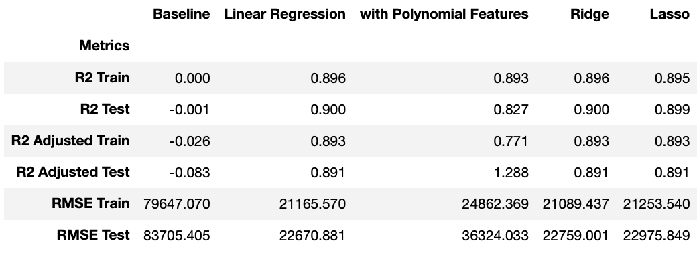
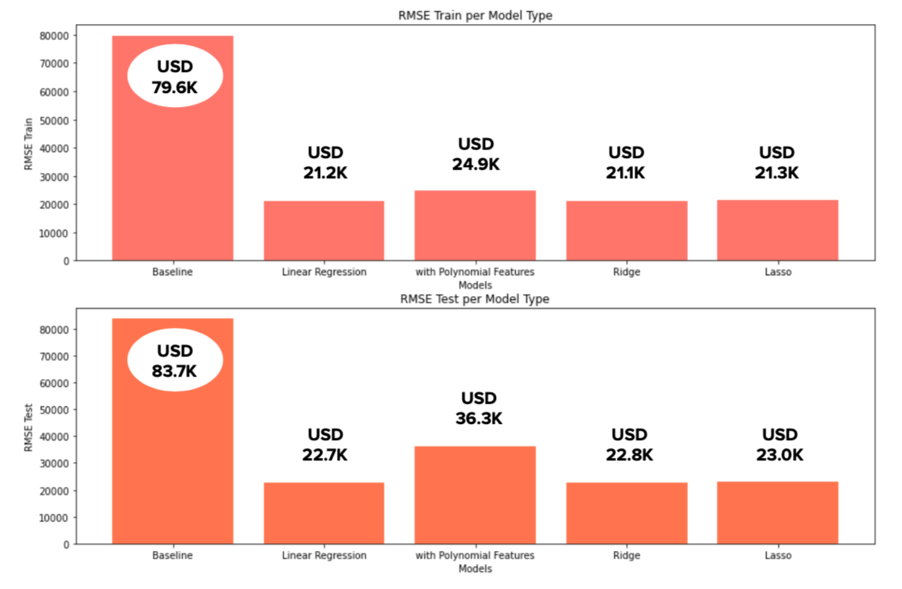
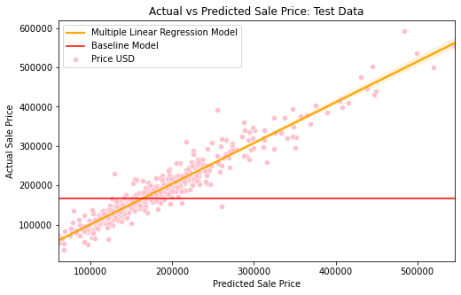
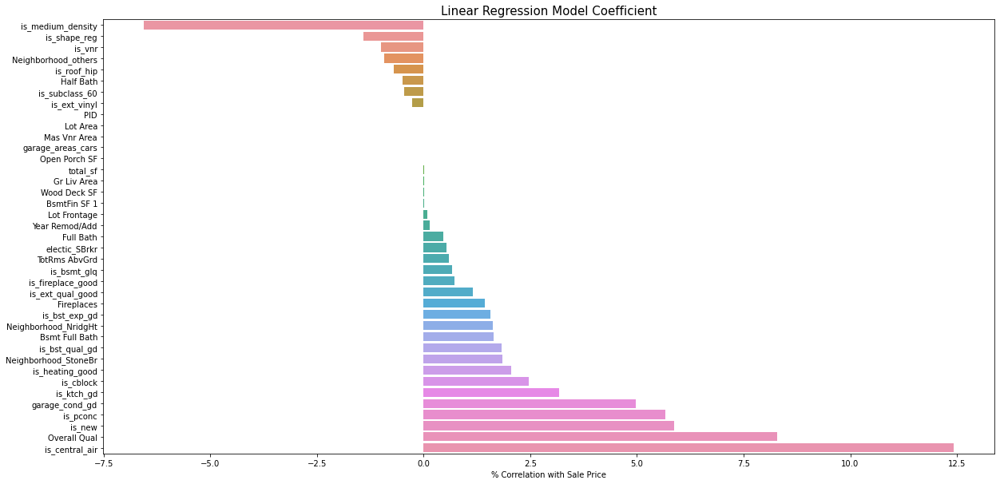

# Project 2 - Ames Housing Data and Kaggle Challenge

## I. Problem Statement 

Company X is a newly launched Customer-to-Customer marketplace that aims to empower individuals to be able to buy/sell property without the hassle and high commission rates of real estate agents. One feature the company wants to provide is a pricing mechanism to help sellers determine the price they should market their property at and what they can do to get a better price for their home. 

I was hired to create a model that would be able to predict price based on local housing data; to help potential sellers determine market price for their particular house based on their features, and if possible, create a list of recommendations that the user can improve on to increase their house price.

## II. Executive Summary

### Data Cleaning and Feature Engineering

For the dataset, all null values were replaced with appropriate values based on the definition provided within the [data dictionary](http://jse.amstat.org/v19n3/decock/DataDocumentation.txt) and observations made on the data. A number of categorical columns and numerical columns have been engineered using binning, creating binary classification and interactive columns, and numification of qualitative features to minimize the number of X variables used in the model. Only features with a correlation of higher than or equal to 0.25 and lower than or equal to -0.25 with sale price was used to avoid overfitting.

### Modeling

Overall, if we were too look at the R2 scores and RMSE, all model performed better than the baseline model (as expected). However when we look at adjusted R2 for the model with polynomial features that have not been regularized, we can see that it is larger than 1, this is due to the fact that when polynomialized there were more features than there were predicted values, which is not a best practice when modeling with linear regression. From this we can observe how Ridge and Lasso's ability to remove features automatically to fulfill the assumption of no multicoliniearity improves the overall performance of the model.

By comparing the three best models (MLR, Ridge and Lasso) with the same R2 adjusted score, we see that non-regularized Multiple Linear Regression have a slightly better performance in RMSE at USD 21.2K and USD 22.7K for train and test data, respectively. Not only that, but it's ability to be interpreted is more direct when compared to the other two, which fulfills the client's request for a list of recommendations for users on features they can improve on to be able to increase their house's price.

## III. Conclusion and Recommendation

For the client's purposes, it is recommended for Company X to use the Multiple Linear Regression model for their pricing mechanism because:

1. Out of all the 5 models (baseline, MLR, LR with Polynomial Features, Ridge and Lasso), it has the best Root Mean Squared Error, which means the difference between predictions and actual sale price is smaller and therefore the model is relatively more accurate

2. It has a high R2 and R2 adjusted score, and similar scores for both train and test which means the model is a relatively good fit in predicting actual sale price

3. Coefficients are easier to interpret and therefore a list of recommendation regarding features that can be improved on so that sellers can get higher prices on their house can be created

Looking at the graph above, we can see that the model is predicting relatively well for houses below ~USD 450K. To improve the model, it may be beneficial to have more training data on houses with higher prices.

Based on the coefficient interpretations, we can make the following recommendation of improvements to sellers who want to sell their houses at a higher price:

1. Add central air conditioning: for every 1-unit increase of central air conditioning, house sale price may increase by 12.4%, ceteris paribus.

2. Improve overall house quality: a 1-unit improvement in the overall quality of the house can result in an 8.3% increase in price, ceteris paribus. The following features are highly correlated to overall house quality:
- Kitchen quality
- Garage capacity and quality
- Exterior look
- Fireplace / heating
- Foundation (particularly houses with concrete block foundation)

3. If your house is new, price may be 5.9% higher in comparison to older counterparts, ceteris paribus.